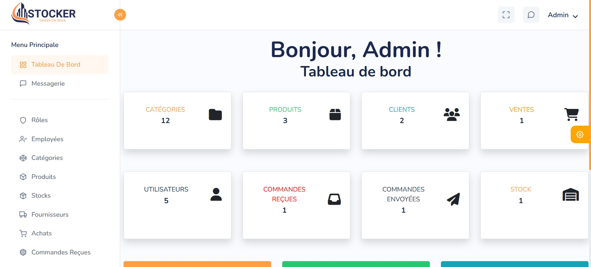

# Gestion de Stock Project

## Description
Ce projet est un système complet de gestion de stock conçu pour gérer divers aspects du contrôle des stocks, des ventes, des interactions avec les clients et les fournisseurs. Voici les principales fonctionnalités de l'application :

### Fonctionnalités principales :
- **Ventes** : Gestion des transactions de ventes avec des enregistrements détaillés.
- **Rôles** : Définition et attribution des rôles pour les employés afin de contrôler l'accès.
- **Employés** : Gestion des profils des employés et des informations associées.
- **Messagerie** : Système de messagerie interne pour la communication entre le personnel.
- **Catégorie** : Organisation des produits en catégories pour une gestion simplifiée.
- **Produit** : Gestion de l'inventaire des produits et des informations détaillées sur chaque produit.
- **Stock** : Suivi et mise à jour des niveaux de stock.
- **Fournisseur** : Gestion des informations des fournisseurs et des interactions.
- **Achat** : Suivi de l'historique des achats.
- **Commande Reçue** : Gestion des commandes reçues.
- **Clients** : Gestion des informations des clients.
- **Facture de Ventes** : Génération des factures de ventes pour les transactions.
- **Commandes Envoyées** : Suivi des commandes envoyées aux clients ou fournisseurs.
- **Livraison** : Gestion des livraisons et mise à jour des statuts de livraison.

## Screenshots

Voici les captures d'écran montrant la page de connexion et le tableau de bord :

### Page de Connexion


### Tableau de Bord


## Installation

1. Clone le dépôt avec la commande suivante :
   ```bash
   git clone https://your-repository-url.git
